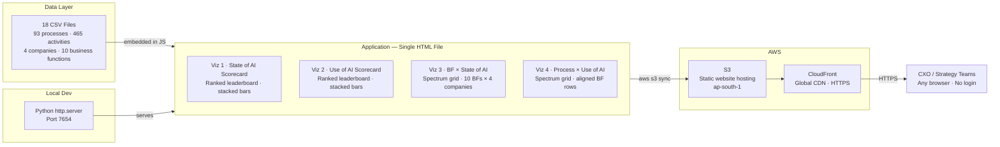
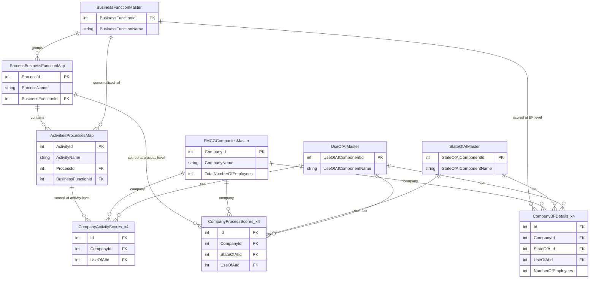

# Architecture

## System Overview

The dashboard is a single static HTML file. All computation happens at page load in the browser. There is no server-side logic, no database, and no API calls at runtime.



## Components

| Component | Role | Technology |
|---|---|---|
| `Build/state_of_ai_scorecard.html` | All four visualisations — JS data, rendering logic, CSS | Vanilla HTML/JS/CSS |
| `Build/assets/logos/` | Company logo SVGs — generic letter avatars | SVG |
| AWS S3 (`fmcg-ai-benchmarking-dashboard`) | Static file hosting | AWS S3 — ap-south-1 |
| AWS CloudFront (`E3EF4S9G53A1LL`) | HTTPS + global CDN | AWS CloudFront |
| Python `http.server` | Local development server | Python 3 stdlib |

## Data Flow

1. **Source data**: 18 CSV files define the raw dataset — 93 processes, 465 activities, 10 business functions, 4 companies
2. **Pre-processing**: Aggregate counts (processes per tier per company per BF) computed from the CSVs and embedded directly as JS arrays in the HTML file
3. **Page load**: Browser parses the HTML, JS IIFEs execute and render all four visualisations via DOM `innerHTML`
4. **No network calls**: Once the HTML file is loaded, all rendering is local — no fetch, no XHR, no CDN fonts

---

## Data Model

The 18 source CSV files form a 3-tier star schema. Reference tables define the universe of companies, business functions, processes, activities, and AI tier labels. Taxonomy tables map processes to business functions and activities to processes. Company scoring tables carry the AI classification for each company at each grain.

### File Catalogue

| Tier | File | Rows | Grain |
|---|---|---|---|
| Reference | `FMCGCompaniesMaster.csv` | 4 | One row per company |
| Reference | `BusinessFunctionMaster.csv` | 10 | One row per business function |
| Reference | `StateOfAIMaster.csv` | 4 | One row per State of AI tier |
| Reference | `UseOfAIMaster.csv` | 4 | One row per Use of AI tier |
| Taxonomy | `ProcessBusinessFunctionMap.csv` | 93 | One row per process |
| Taxonomy | `ActivitiesProcessesMap.csv` | 465 | One row per activity |
| Company · BF | `HULBusinessFunctionsDetails.csv` | 10 | HUL AI score + headcount per BF |
| Company · BF | `PandGBusinessFunctionsDetails.csv` | 10 | P&G AI score + headcount per BF |
| Company · BF | `LorealBusinessFunctionsDetails.csv` | 10 | L'Oréal AI score + headcount per BF |
| Company · BF | `NestleBusinessFunctionsDetails.csv` | 10 | Nestlé AI score + headcount per BF |
| Company · Process | `HULProcessBusinessFunctionMap.csv` | 93 | HUL AI score per process |
| Company · Process | `PandGProcessBusinessFunctionMap.csv` | 93 | P&G AI score per process |
| Company · Process | `LorealProcessBusinessFunctionMap.csv` | 93 | L'Oréal AI score per process |
| Company · Process | `NestleProcessBusinessFunctionMap.csv` | 93 | Nestlé AI score per process |
| Company · Activity | `HULActivitiesProcessesMap.csv` | 465 | HUL Use of AI score per activity |
| Company · Activity | `PandGActivitiesProcessesMap.csv` | 465 | P&G Use of AI score per activity |
| Company · Activity | `LorealActivitiesProcessesMap.csv` | 465 | L'Oréal Use of AI score per activity |
| Company · Activity | `NestleActivitiesProcessesMap.csv` | 465 | Nestlé Use of AI score per activity |

---

### Schemas

#### Reference Tables

**`FMCGCompaniesMaster.csv`** — 4 rows

| Column | Type | Role |
|---|---|---|
| `CompanyId` | INT | PK |
| `CompanyName` | STRING | Company display name |
| `TotalNumberOfEmployees` | INT | Total headcount (India entity) |

Values: `1` = HUL (18,240) · `2` = P&G (3,744) · `3` = L'Oréal (2,300) · `4` = Nestlé (7,980)

---

**`BusinessFunctionMaster.csv`** — 10 rows

| Column | Type | Role |
|---|---|---|
| `BusinessFunctionId` | INT | PK — 1–10 |
| `BusinessFunctionName` | STRING | Business function display name |

Functions in order: `1` Marketing & Brand Management · `2` Sales & Distribution · `3` Supply Chain · `4` R&D / Product Development · `5` Finance · `6` HR · `7` Legal & Regulatory / Compliance · `8` IT / Digital · `9` Manufacturing / Operations · `10` Corporate Affairs / External Affairs

---

**`StateOfAIMaster.csv`** — 4 rows

| Column | Type | Role |
|---|---|---|
| `StateOfAIComponentId` | INT | PK — 1–4 |
| `StateOfAIComponentName` | STRING | Tier label |

| Id | Label | Semantic rank |
|---|---|---|
| `1` | AI Application | 2nd most advanced |
| `2` | AI Adoption | 3rd most advanced |
| `3` | AI Nativeness | Most advanced (north star) |
| `4` | Without AI | Least advanced |

> ⚠️ IDs do **not** reflect advancement order. Semantic order (advanced → lagging): AI Nativeness (3) → AI Application (1) → AI Adoption (2) → Without AI (4).

---

**`UseOfAIMaster.csv`** — 4 rows

| Column | Type | Role |
|---|---|---|
| `UseOfAIComponentId` | INT | PK — 1–4 |
| `UseOfAIComponentName` | STRING | Tier label |

| Id | Label | Semantic rank |
|---|---|---|
| `1` | AI Assisted | 3rd most advanced |
| `2` | AI Enabled | 2nd most advanced |
| `3` | Autonomous AI | Most advanced (north star) |
| `4` | No AI use at all | Least advanced |

> ⚠️ IDs do **not** reflect advancement order. Semantic order (advanced → lagging): Autonomous AI (3) → AI Enabled (2) → AI Assisted (1) → No AI use at all (4). When building the `bfCounts` array for Viz 4, column order must follow semantic rank — not ascending numeric Id.

---

#### Taxonomy Tables

**`ProcessBusinessFunctionMap.csv`** — 93 rows

| Column | Type | Role |
|---|---|---|
| `ProcessId` | INT | PK — 1–93 |
| `ProcessName` | STRING | Process display name |
| `BusinessFunctionId` | INT | FK → `BusinessFunctionMaster.BusinessFunctionId` |

Process count per BF: Marketing (10) · Sales & Distribution (9) · Supply Chain (9) · R&D / Product Dev (9) · Finance (10) · HR (10) · Legal & Regulatory (9) · IT / Digital (9) · Manufacturing (10) · Corporate Affairs (8) = **93 total**

---

**`ActivitiesProcessesMap.csv`** — 465 rows

| Column | Type | Role |
|---|---|---|
| `ActivityId` | INT | PK — 1–465 |
| `ActivityName` | STRING | Granular activity description |
| `ProcessId` | INT | FK → `ProcessBusinessFunctionMap.ProcessId` |
| `BusinessFunctionId` | INT | FK → `BusinessFunctionMaster.BusinessFunctionId` |

5 activities per process × 93 processes = **465 activities**. `BusinessFunctionId` is denormalised — derivable via `ProcessId → ProcessBusinessFunctionMap`, but retained for direct BF-level aggregations without a join.

---

#### Company-Specific Business Function Tables — 4 files × 10 rows

Schema is identical across all four files; only the column name prefix changes (`HUL`, `PandG`, `Loreal`, `Nestle`).

**`{Company}BusinessFunctionsDetails.csv`**

| Column | Type | Role |
|---|---|---|
| `Id` | INT | Implicit FK → `BusinessFunctionMaster.BusinessFunctionId` (row position = BF Id, 1–10) |
| `{Co}CompanyId` | INT | FK → `FMCGCompaniesMaster.CompanyId` (constant within each file) |
| `{Co}StateOfAIId` | INT | FK → `StateOfAIMaster.StateOfAIComponentId` — BF-level State of AI |
| `{Co}UseOfAIId` | INT | FK → `UseOfAIMaster.UseOfAIComponentId` — BF-level Use of AI |
| `{Co}NumberOfEmployees` | INT | Headcount allocated to this BF for this company |

The sum of `NumberOfEmployees` across all 10 rows equals `TotalNumberOfEmployees` in `FMCGCompaniesMaster`.

Headcount per BF (BF order 1–10):
- **HUL**: 950 · 5,700 · 1,330 · 760 · 950 · 570 · 380 · 760 · 6,650 · 190 = 18,240
- **P&G**: 195 · 780 · 312 · 273 · 195 · 117 · 78 · 195 · 1,560 · 39 = 3,744
- **L'Oréal**: 250 · 750 · 175 · 125 · 125 · 75 · 50 · 125 · 600 · 25 = 2,300
- **Nestlé**: 336 · 1,680 · 672 · 168 · 420 · 252 · 168 · 420 · 3,780 · 84 = 7,980

---

#### Company-Specific Process Tables — 4 files × 93 rows

**`{Company}ProcessBusinessFunctionMap.csv`**

| Column | Type | Role |
|---|---|---|
| `Id` | INT | Implicit FK → `ProcessBusinessFunctionMap.ProcessId` (row position = ProcessId, 1–93) |
| `{Co}CompanyId` | INT | FK → `FMCGCompaniesMaster.CompanyId` |
| `{Co}StateOfAIId` | INT | FK → `StateOfAIMaster.StateOfAIComponentId` — process-level State of AI |
| `{Co}UseOfAIId` | INT | FK → `UseOfAIMaster.UseOfAIComponentId` — process-level Use of AI |

`ProcessName` and `BusinessFunctionId` are not repeated — join to `ProcessBusinessFunctionMap` via `Id = ProcessId` to retrieve them.

---

#### Company-Specific Activity Tables — 4 files × 465 rows

**`{Company}ActivitiesProcessesMap.csv`**

| Column | Type | Role |
|---|---|---|
| `Id` | INT | Implicit FK → `ActivitiesProcessesMap.ActivityId` (row position = ActivityId, 1–465) |
| `{Co}CompanyId` | INT | FK → `FMCGCompaniesMaster.CompanyId` |
| `{Co}UseOfAIId` | INT | FK → `UseOfAIMaster.UseOfAIComponentId` — activity-level Use of AI |

**State of AI is not scored at activity level** — only at process and BF level. State of AI is a holistic maturity classification of a whole process; it cannot be meaningfully applied to individual activities within it.

---

### Entity Relationships



`CompanyBFDetails_x4`, `CompanyProcessScores_x4`, and `CompanyActivityScores_x4` each represent 4 physical files (one per company). The `Id` column in each is an implicit FK — row `n` maps to `BusinessFunctionId` / `ProcessId` / `ActivityId` = `n` in the corresponding base table.

---

### Aggregation Pipeline (CSV → JavaScript)

The dashboard embeds pre-aggregated values — the raw CSVs are never fetched at runtime. To update the dashboard with new data, re-run the aggregations below and patch the four JS data blocks in `Build/state_of_ai_scorecard.html`.

**Viz 1 — State of AI Scorecard** · source: company process tables

```
For each company:
  COUNT rows in {Co}ProcessBusinessFunctionMap WHERE {Co}StateOfAIId = X
  → one count per tier (AI Nativeness, AI Application, AI Adoption, Without AI)

Maps to JS: companies[i] = { aiNative, aiApp, aiAdop, withoutAI }
Constraint: aiNative + aiApp + aiAdop + withoutAI must equal TOTAL_PROCESSES (93)
```

| Company | AI Nativeness | AI Application | AI Adoption | Without AI |
|---|---|---|---|---|
| HUL | 0 | 6 | 79 | 8 |
| P&G | 0 | 27 | 62 | 4 |
| L'Oréal | 0 | 13 | 75 | 5 |
| Nestlé | 0 | 9 | 80 | 4 |

---

**Viz 2 — Use of AI Scorecard** · source: company activity tables

```
For each company:
  COUNT rows in {Co}ActivitiesProcessesMap WHERE {Co}UseOfAIId = X
  → one count per tier (Autonomous AI, AI Assisted, AI Enabled, No AI use at all)

Maps to JS: companies[i] = { autoAI, aiAssist, aiEnable, noAI }
Constraint: autoAI + aiAssist + aiEnable + noAI must equal TOTAL_ACTIVITIES (465)
```

| Company | Autonomous AI | AI Assisted | AI Enabled | No AI use at all |
|---|---|---|---|---|
| HUL | 0 | 143 | 41 | 281 |
| P&G | 0 | 126 | 144 | 195 |
| L'Oréal | 0 | 142 | 57 | 266 |
| Nestlé | 0 | 145 | 57 | 263 |

---

**Viz 3 — Business Function × State of AI** · source: company BF tables

```
For each company:
  SELECT {Co}StateOfAIId for rows Id = 1–10 (one per BF, in BF order)

Maps to JS: companies[i].bfStates = [int × 10]
  where each int is a StateOfAIMaster.StateOfAIComponentId (1–4)
  and array index 0 = BF 1 (Marketing), ..., index 9 = BF 10 (Corporate Affairs)
```

Current value for all companies, all BFs: `2` (AI Adoption) — every cell. The AI Nativeness, AI Application, and Without AI rows in Viz 3 are intentionally empty; this reflects the actual dataset, not a rendering bug.

---

**Viz 4 — Process × Use of AI** · source: company process tables + base process table

```
For each company:
  JOIN {Co}ProcessBusinessFunctionMap (Id) WITH ProcessBusinessFunctionMap (ProcessId)
    → get BusinessFunctionId for each of the 93 process rows
  GROUP BY BusinessFunctionId, {Co}UseOfAIId → COUNT(ProcessId)
  → 10 BFs × 4 Use of AI tiers = 40 counts per company

Maps to JS: companies[i].bfCounts = [
  [autonomousAI_count, aiEnabled_count, aiAssisted_count, noAI_count],  // BF 1
  [autonomousAI_count, aiEnabled_count, aiAssisted_count, noAI_count],  // BF 2
  ...                                                                    // BF 3–10
]
```

> ⚠️ Inner array column order is `[Autonomous AI (Id=3), AI Enabled (Id=2), AI Assisted (Id=1), No AI (Id=4)]` — matching Viz 4's top-to-bottom row order. This is **not** ascending numeric Id order.

> ⚠️ BF row alignment: for each BF, the sum across all 4 tier counts must be identical for all 4 companies. If BF 1 has 10 processes for HUL, it must have 10 for P&G, L'Oréal, and Nestlé. Mismatches cause fixed-height rows to misalign across company columns with no error thrown.

---

### Data Constraints

| Constraint | Rule | Consequence if violated |
|---|---|---|
| Process totals (Viz 1) | Each company's 4 tier counts sum to `TOTAL_PROCESSES = 93` | Bar percentages don't reach 100% |
| Activity totals (Viz 2) | Each company's 4 tier counts sum to `TOTAL_ACTIVITIES = 465` | Bar percentages don't reach 100% |
| BF process alignment (Viz 4) | For each BF, total process count across tiers is identical across all 4 companies | Same BF lands on different row heights across columns — silent misalignment |
| BF headcount totals | Sum of `NumberOfEmployees` across all 10 BF rows = `TotalNumberOfEmployees` in `FMCGCompaniesMaster` | Headcount figures are internally inconsistent |
| UseOfAI sort order | `bfCounts` inner array follows semantic rank order `[Id=3, Id=2, Id=1, Id=4]`, not ascending numeric | Wrong processes appear in wrong Viz 4 rows |

---

## The Four Visualisations

### Viz 1 — State of AI Scorecard
- **Type**: Rank leaderboard (horizontal stacked bars)
- **Data**: Process counts per State of AI tier, per company (total: 93 processes)
- **Ranked by**: Processes at AI Application state
- **Tiers**: AI Nativeness (purple) → AI Application (blue) → AI Adoption (green) → Without AI (red)

### Viz 2 — Use of AI Scorecard
- **Type**: Rank leaderboard (horizontal stacked bars)
- **Data**: Activity counts per Use of AI tier, per company (total: 465 activities)
- **Ranked by**: Activities at AI Assisted level
- **Tiers**: Autonomous AI (purple) → AI Assisted (green) → AI Enabled (blue) → No AI (red)
- **Note**: Bar segments render AI Assisted before AI Enabled (most-volume tier leads); semantic hierarchy is Autonomous AI > AI Enabled > AI Assisted > No AI

### Viz 3 — Business Function × State of AI
- **Type**: Spectrum grid (5-column: label + 4 company columns)
- **Data**: State of AI assignment per business function per company
- **Rows**: AI Nativeness ⭐ → AI Application → AI Adoption → Without AI
- **Cells**: BF name chips coloured by tier
- **Data note**: In the current dataset all 10 business functions for all 4 companies sit at AI Adoption level; the AI Nativeness, AI Application, and Without AI rows are intentionally empty (shown as dashes)

### Viz 4 — Process × Use of AI
- **Type**: Spectrum grid with fixed-height aligned rows
- **Data**: Process counts by Use of AI tier, per business function, per company
- **Rows**: Autonomous AI ⭐ → AI Enabled → AI Assisted → No AI Use at All
- **Key feature**: Fixed 30px rows with gap-rows ensure the same BF always sits on the same visual row across all company columns

## CSS Design System

```css
--ai-native:  #7B3FCC   /* purple  — AI Nativeness / Autonomous AI */
--ai-app:     #2E7FD4   /* blue    — AI Application / AI Enabled */
--ai-adop:    #1A9968   /* green   — AI Adoption / AI Assisted */
--no-ai:      #D13B4B   /* red     — Without AI / No AI Use at All */
--subject-accent: #E85D20   /* orange  — subject company highlight */
```

Bar track: `height: 52px; border-radius: 8px; overflow: hidden` — `overflow:hidden` clips segments cleanly without per-segment border-radius.

Spectrum grid: `grid-template-columns: 150px 1fr 1fr 1fr 1fr`

## Infrastructure

| Resource | Value |
|---|---|
| S3 bucket | `fmcg-ai-benchmarking-dashboard` |
| S3 region | `ap-south-1` (Mumbai) |
| CloudFront distribution | `E3EF4S9G53A1LL` |
| CloudFront domain | `d2hzpx71woh3es.cloudfront.net` |
| Live URL | `https://d2hzpx71woh3es.cloudfront.net/state_of_ai_scorecard.html` |

## AWS Setup (from scratch)

```bash
# 1. Create S3 bucket
aws s3api create-bucket \
  --bucket YOUR-BUCKET-NAME \
  --region ap-south-1 \
  --create-bucket-configuration LocationConstraint=ap-south-1

# 2. Disable block public access
aws s3api delete-public-access-block --bucket YOUR-BUCKET-NAME

# 3. Set public read policy
aws s3api put-bucket-policy --bucket YOUR-BUCKET-NAME --policy '{
  "Version":"2012-10-17",
  "Statement":[{"Effect":"Allow","Principal":"*",
    "Action":"s3:GetObject","Resource":"arn:aws:s3:::YOUR-BUCKET-NAME/*"}]
}'

# 4. Enable static website hosting
aws s3 website s3://YOUR-BUCKET-NAME \
  --index-document state_of_ai_scorecard.html

# 5. Upload files
aws s3 sync Build s3://YOUR-BUCKET-NAME \
  --cache-control "no-cache, no-store, must-revalidate"

# 6. Create CloudFront distribution
# Write the distribution config to a temp file, then create
cat > /tmp/cf-dist.json << 'EOF'
{
  "CallerReference": "fmcg-dashboard-$(date +%s)",
  "Comment": "FMCG AI Benchmarking Dashboard",
  "Enabled": true,
  "DefaultRootObject": "state_of_ai_scorecard.html",
  "Origins": {
    "Quantity": 1,
    "Items": [{
      "Id": "s3-website",
      "DomainName": "YOUR-BUCKET.s3-website.ap-south-1.amazonaws.com",
      // Note: endpoint format varies by region.
      // ap-south-1, eu-west-1, etc. → bucket.s3-website.REGION.amazonaws.com (dot-separated)
      // us-east-1                   → bucket.s3-website-us-east-1.amazonaws.com (dash after "s3-website")
      "CustomOriginConfig": {
        "HTTPPort": 80,
        "HTTPSPort": 443,
        "OriginProtocolPolicy": "http-only"
      }
    }]
  },
  "DefaultCacheBehavior": {
    "TargetOriginId": "s3-website",
    "ViewerProtocolPolicy": "redirect-to-https",
    "AllowedMethods": {
      "Quantity": 2,
      "Items": ["GET", "HEAD"],
      "CachedMethods": { "Quantity": 2, "Items": ["GET", "HEAD"] }
    },
    "CachePolicyId": "658327ea-f89d-4fab-a63d-7e88639e58f6",
    "Compress": true
  }
}
EOF
aws cloudfront create-distribution --distribution-config file:///tmp/cf-dist.json
# Note the "DomainName" in the output (e.g. d1234abc.cloudfront.net) — that is your live URL.
# Status will show "InProgress" for ~15 minutes; the domain is usable immediately.

# 7. Invalidate on update
aws cloudfront create-invalidation \
  --distribution-id YOUR-DISTRIBUTION-ID --paths "/*"
```

## Key Design Decisions

**Single file over separate JS/CSS bundles** — Eliminates all module resolution, bundling, and build tooling. The file is large but self-contained. Any engineer can read the source without a build environment.

**Data embedded in JS over a runtime API** — Pre-embedding removes all latency, CORS configuration, and server dependency. Acceptable because the underlying benchmarking data changes on a quarterly cycle, not in real time.

**CloudFront over direct S3 URL** — S3 static website endpoints are HTTP-only. CloudFront provides HTTPS, global edge caching, and professional-grade URLs suitable for executive sharing.

**Fixed 30px BF rows (Viz 4)** — The spectrum grid computes a global list of active business functions per tier across all companies before rendering. Each company column iterates this global list in order, emitting a chip row for BFs with data or a gap row where count=0. This ensures cross-column visual alignment without CSS Grid subgrid (not universally supported) or JavaScript layout measurement.
