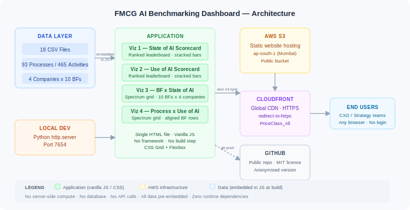

# Architecture

## System Overview

The dashboard is a single static HTML file. All computation happens at page load in the browser. There is no server-side logic, no database, and no API calls at runtime.



## Components

| Component | Role | Technology |
|---|---|---|
| `Build/state_of_ai_scorecard.html` | All four visualisations — JS data, rendering logic, CSS | Vanilla HTML/JS/CSS |
| `Build/assets/logos/` | Company logo SVGs (anonymised in public version) | SVG |
| `docs/architecture.svg` | Architecture diagram | SVG |
| AWS S3 (`fmcg-ai-benchmarking-dashboard`) | Static file hosting | AWS S3 — ap-south-1 |
| AWS CloudFront (`E3EF4S9G53A1LL`) | HTTPS + global CDN | AWS CloudFront |
| Python `http.server` | Local development server | Python 3 stdlib |

## Data Flow

1. **Source data**: 18 CSV files define the raw dataset — 93 processes, 465 activities, 10 business functions, 4 companies
2. **Pre-processing**: Aggregate counts (processes per tier per company per BF) computed manually and embedded as JS arrays in the HTML file
3. **Page load**: Browser parses the HTML, JS IIFEs execute and render all four visualisations via DOM `innerHTML`
4. **No network calls**: Once the HTML file is loaded, all rendering is local — no fetch, no XHR, no CDN fonts

## The Four Visualisations

### Viz 1 — State of AI Scorecard
- **Type**: Rank leaderboard (horizontal stacked bars)
- **Data**: Process counts per State of AI tier, per company (total: 93 processes)
- **Ranked by**: Processes at AI Application state
- **Tiers**: AI Nativeness (purple) → AI Application (blue) → AI Adoption (green) → Without AI (red)

### Viz 2 — Use of AI Scorecard
- **Type**: Rank leaderboard (horizontal stacked bars)
- **Data**: Activity counts per Use of AI tier, per company (total: 465 activities)
- **Ranked by**: Activities at AI Assisted level
- **Tiers**: Autonomous AI (purple) → AI Enabled (blue) → AI Assisted (green) → No AI (red)

### Viz 3 — Business Function × State of AI
- **Type**: Spectrum grid (5-column: label + 4 company columns)
- **Data**: State of AI assignment per business function per company
- **Rows**: AI Nativeness ⭐ → AI Application → AI Adoption → Without AI
- **Cells**: BF name chips coloured by tier

### Viz 4 — Process × Use of AI
- **Type**: Spectrum grid with fixed-height aligned rows
- **Data**: Process counts by Use of AI tier, per business function, per company
- **Rows**: Autonomous AI ⭐ → AI Enabled → AI Assisted → No AI Use at All
- **Key feature**: Fixed 30px rows with gap-rows ensure the same BF always sits on the same visual row across all company columns

## CSS Design System

```css
--ai-native:  #7B3FCC   /* purple  — AI Nativeness / Autonomous AI */
--ai-app:     #2E7FD4   /* blue    — AI Application / AI Enabled */
--ai-adop:    #1A9968   /* green   — AI Adoption / AI Assisted */
--no-ai:      #D13B4B   /* red     — Without AI / No AI Use at All */
--hul-accent: #E85D20   /* orange  — subject company highlight */
```

Bar track: `height: 52px; border-radius: 8px; overflow: hidden` — `overflow:hidden` clips segments cleanly without per-segment border-radius.

Spectrum grid: `grid-template-columns: 150px 1fr 1fr 1fr 1fr`

## Infrastructure

| Resource | Value |
|---|---|
| S3 bucket | `fmcg-ai-benchmarking-dashboard` |
| S3 region | `ap-south-1` (Mumbai) |
| CloudFront distribution | `E3EF4S9G53A1LL` |
| CloudFront domain | `d2hzpx71woh3es.cloudfront.net` |
| Live URL | `https://d2hzpx71woh3es.cloudfront.net/state_of_ai_scorecard.html` |

## AWS Setup (from scratch)

```bash
# 1. Create S3 bucket
aws s3api create-bucket \
  --bucket YOUR-BUCKET-NAME \
  --region ap-south-1 \
  --create-bucket-configuration LocationConstraint=ap-south-1

# 2. Disable block public access
aws s3api delete-public-access-block --bucket YOUR-BUCKET-NAME

# 3. Set public read policy
aws s3api put-bucket-policy --bucket YOUR-BUCKET-NAME --policy '{
  "Version":"2012-10-17",
  "Statement":[{"Effect":"Allow","Principal":"*",
    "Action":"s3:GetObject","Resource":"arn:aws:s3:::YOUR-BUCKET-NAME/*"}]
}'

# 4. Enable static website hosting
aws s3 website s3://YOUR-BUCKET-NAME \
  --index-document state_of_ai_scorecard.html

# 5. Upload files
aws s3 sync Build s3://YOUR-BUCKET-NAME \
  --cache-control "no-cache, no-store, must-revalidate"

# 6. Create CloudFront distribution (use S3 website endpoint as custom origin)
# See AWS Console for full distribution config, or adapt the CLI call in context.md

# 7. Invalidate on update
aws cloudfront create-invalidation \
  --distribution-id YOUR-DISTRIBUTION-ID --paths "/*"
```

## Key Design Decisions

**Single file over separate JS/CSS bundles** — Eliminates all module resolution, bundling, and build tooling. The file is large but self-contained. Any engineer can read the source without a build environment.

**Data embedded in JS over a runtime API** — Pre-embedding removes all latency, CORS configuration, and server dependency. Acceptable because the underlying benchmarking data changes on a quarterly cycle, not in real time.

**CloudFront over direct S3 URL** — S3 static website endpoints are HTTP-only. CloudFront provides HTTPS, global edge caching, and professional-grade URLs suitable for executive sharing.

**Fixed 30px BF rows (Viz 4)** — The spectrum grid computes a global list of active business functions per tier across all companies before rendering. Each company column iterates this global list in order, emitting a chip row for BFs with data or a gap row where count=0. This ensures cross-column visual alignment without CSS Grid subgrid (not universally supported) or JavaScript layout measurement.
