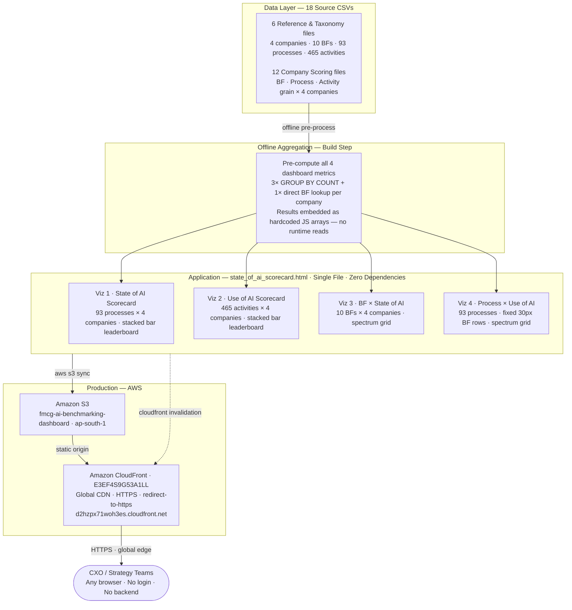
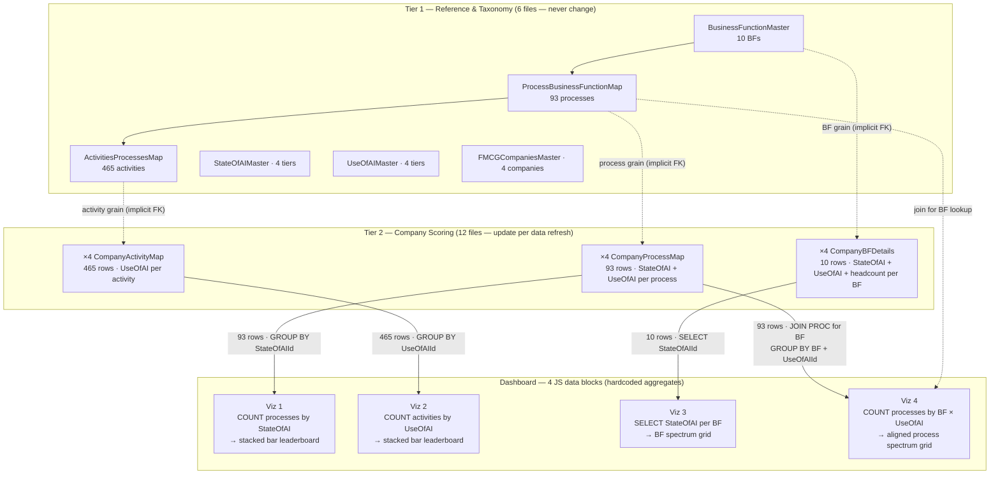
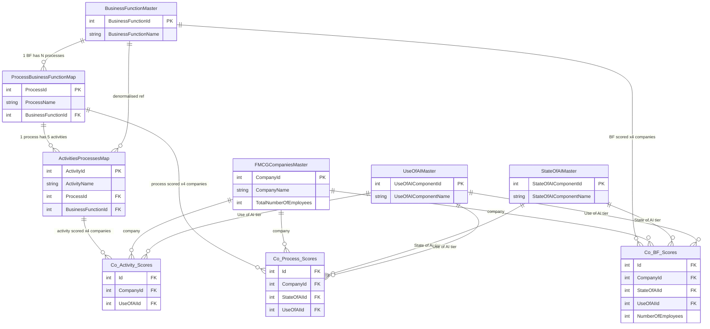

# Architecture

## System Overview

The dashboard is a single static HTML file. All aggregation computation runs offline at build time — GROUP BY COUNT operations are executed against the source CSVs and the results hardcoded as JS arrays in the HTML. At page load, the browser renders those pre-computed values; there is no server-side logic, no database, and no API calls at runtime.



## Components

| Component | Role | Environment |
|---|---|---|
| `Data/*.csv` (18 files) | Source of truth — companies, BFs, processes, activities, AI tier classifications | Build time only — never deployed |
| Python aggregation scripts | Compute the 4 dashboard metrics from CSVs; results pasted into HTML JS data blocks | Build time only |
| `Build/state_of_ai_scorecard.html` | All four visualisations — hardcoded JS data, rendering logic, CSS | Production (deployed to S3) |
| `Build/assets/logos/` | Company logo SVGs — generic letter avatars | Production (deployed to S3) |
| AWS S3 (`fmcg-ai-benchmarking-dashboard`) | Static file hosting | Production — ap-south-1 |
| AWS CloudFront (`E3EF4S9G53A1LL`) | HTTPS + global CDN + redirect-to-https | Production |

## Build and Runtime Flow

1. **Source data**: 18 CSV files define the raw dataset — 93 processes, 465 activities, 10 business functions, 4 companies
2. **Offline aggregation** *(manual, build time)*: Run 4 Python scripts against the CSVs to compute dashboard metrics. Copy the output counts into the 4 JS data blocks in `Build/state_of_ai_scorecard.html`. These are two separate manual steps — there is no script that auto-embeds the results.
3. **Deploy** *(manual)*: `aws s3 sync` uploads the updated HTML to S3; `aws cloudfront create-invalidation` flushes the CDN cache.
4. **Page load** *(automated, runtime)*: Browser downloads the HTML from CloudFront, JS IIFEs execute, and all four visualisations render via DOM `innerHTML`. No fetch, no XHR, no CDN fonts — the file is fully self-contained.

---

## Data Model

The dashboard computes four aggregations over 18 CSV source files: three GROUP BY COUNT operations (Viz 1, 2, 4) and one direct per-row lookup (Viz 3 reads BF-level State of AI tier directly from the BF scoring file — no counting). If you understand the data, the visuals follow naturally: Viz 1 and 2 are stacked bars whose widths come from tier counts; Viz 3 is a grid of 40 direct BF lookups (10 BFs × 4 companies); Viz 4 is a grid populated by BF-grouped process counts. This section documents the schema, relationships, and exact aggregation pipeline so that updating the dashboard with new data requires no reverse-engineering of the HTML.

### Data Flow — CSV to Dashboard



> `FMCGCompaniesMaster`, `StateOfAIMaster`, and `UseOfAIMaster` are FK reference tables. They constrain `{Co}CompanyId`, `{Co}StateOfAIId`, and `{Co}UseOfAIId` values in all 12 Tier 2 scoring files but do not drive any aggregation pipeline directly — their role is to validate and label the integer IDs stored in the scoring files.

---

### End-to-End Trace

Before reading schemas, walk one data point from raw CSV to its rendered position in the dashboard. This is what the entire pipeline does — 93× for processes, 465× for activities, per company.

**Subject: Process 3 — IMC Planning & Execution (Subject Co.)**

**Step 1 — Find the process in the taxonomy.**

`ProcessBusinessFunctionMap.csv`, row 3:

| ProcessId | ProcessName | BusinessFunctionId |
|---|---|---|
| 3 | Integrated Marketing Communications (IMC) Planning & Execution | 1 (Marketing & Brand Management) |

**Step 2 — Look up Subject Co.'s classification for this process.**

`SubjectCoProcessBusinessFunctionMap.csv`, row 3 (`Id=3` maps to `ProcessId=3` by row position — see Implicit FK below):

| Id | SubjectCoCompanyId | SubjectCoStateOfAIId | SubjectCoUseOfAIId |
|---|---|---|---|
| 3 | 1 (Subject Co.) | 1 (AI Application) | 2 (AI Enabled) |

**Step 3 — See where this process appears in the dashboard.**

- **Viz 1**: `SubjectCoStateOfAIId = 1` (AI Application) → this row is counted in Subject Co.'s `aiApp = 6`
- **Viz 4**: `BusinessFunctionId = 1`, `SubjectCoUseOfAIId = 2` (AI Enabled) → this process appears in the BF01 · AI Enabled row in Subject Co.'s column (one of 2 AI Enabled processes in Marketing)

**Step 4 — Trace one of its five activities into Viz 2.**

`ActivitiesProcessesMap.csv`, activity 11:

| ActivityId | ActivityName | ProcessId |
|---|---|---|
| 11 | Develop annual communication strategy & campaign calendar | 3 |

`SubjectCoActivitiesProcessesMap.csv`, row 11 (`Id=11` maps to `ActivityId=11`):

| Id | SubjectCoCompanyId | SubjectCoUseOfAIId |
|---|---|---|
| 11 | 1 (Subject Co.) | 4 (No AI use at all) |

**Viz 2**: this activity is counted in Subject Co.'s `noAI = 281`.


**Step 5 — Trace the BF into Viz 3.**

`SubjectCoBusinessFunctionsDetails.csv`, row 1 (`Id=1` maps to `BusinessFunctionId=1` = Marketing & Brand Management):

| Id | SubjectCoCompanyId | SubjectCoStateOfAIId | SubjectCoUseOfAIId | SubjectCoNumberOfEmployees |
|---|---|---|---|---|
| 1 | 1 (Subject Co.) | 2 (AI Adoption) | 1 (AI Assisted) | 950 |

**Viz 3**: `SubjectCoStateOfAIId = 2` (AI Adoption) → Marketing & Brand Management chip appears in the AI Adoption row of Subject Co.'s Viz 3 column. (`SubjectCoUseOfAIId` is present in this file but feeds no viz — see schema note below.)

> The dashboard is exactly this 5-step trace, repeated for every process, every activity, and every BF row, for all 4 companies. The resulting counts are pre-computed and hardcoded into the JS.

---

### File Catalogue

> ⚠️ **File names below are anonymised.** Actual files on disk use real company name prefixes, not `SubjectCo`, `FMCGLeader`, `Challenger1`, `Challenger2`. Schema structure and row counts are identical.

| Tier | File | Rows | Grain |
|---|---|---|---|
| Reference | `FMCGCompaniesMaster.csv` | 4 | One row per company |
| Reference | `BusinessFunctionMaster.csv` | 10 | One row per business function |
| Reference | `StateOfAIMaster.csv` | 4 | One row per State of AI tier |
| Reference | `UseOfAIMaster.csv` | 4 | One row per Use of AI tier |
| Taxonomy | `ProcessBusinessFunctionMap.csv` | 93 | One row per process |
| Taxonomy | `ActivitiesProcessesMap.csv` | 465 | One row per activity (5 per process) |
| Company · BF | `SubjectCoBusinessFunctionsDetails.csv` | 10 | Subject Co. State of AI + Use of AI + headcount per BF |
| Company · BF | `FMCGLeaderBusinessFunctionsDetails.csv` | 10 | FMCG Leader — same structure |
| Company · BF | `Challenger1BusinessFunctionsDetails.csv` | 10 | Challenger 1 — same structure |
| Company · BF | `Challenger2BusinessFunctionsDetails.csv` | 10 | Challenger 2 — same structure |
| Company · Process | `SubjectCoProcessBusinessFunctionMap.csv` | 93 | Subject Co. State of AI + Use of AI per process |
| Company · Process | `FMCGLeaderProcessBusinessFunctionMap.csv` | 93 | FMCG Leader — same structure |
| Company · Process | `Challenger1ProcessBusinessFunctionMap.csv` | 93 | Challenger 1 — same structure |
| Company · Process | `Challenger2ProcessBusinessFunctionMap.csv` | 93 | Challenger 2 — same structure |
| Company · Activity | `SubjectCoActivitiesProcessesMap.csv` | 465 | Subject Co. Use of AI per activity |
| Company · Activity | `FMCGLeaderActivitiesProcessesMap.csv` | 465 | FMCG Leader — same structure |
| Company · Activity | `Challenger1ActivitiesProcessesMap.csv` | 465 | Challenger 1 — same structure |
| Company · Activity | `Challenger2ActivitiesProcessesMap.csv` | 465 | Challenger 2 — same structure |

**Tier mapping:** Rows labelled Reference and Taxonomy above are **Tier 1** (6 files, never change). Rows labelled Company · BF/Process/Activity above are **Tier 2** (12 files, update per data refresh). These match the Tier 1 / Tier 2 labels in the Data Flow diagram.

---

### Schemas

#### Reference Tables

**`FMCGCompaniesMaster.csv`** — 4 rows

| Column | Type | Role |
|---|---|---|
| `CompanyId` | INT | PK |
| `CompanyName` | STRING | Display name |
| `TotalNumberOfEmployees` | INT | Total headcount |

`1` = Subject Co. (18,240) · `2` = FMCG Leader (3,744) · `3` = Challenger 1 (2,300) · `4` = Challenger 2 (7,980)

---

**`BusinessFunctionMaster.csv`** — 10 rows

| Column | Type | Role |
|---|---|---|
| `BusinessFunctionId` | INT | PK — 1–10 |
| `BusinessFunctionName` | STRING | Display name |

| Id | Business Function |
|---|---|
| 1 | Marketing & Brand Management |
| 2 | Sales & Distribution |
| 3 | Supply Chain |
| 4 | R&D / Product Development |
| 5 | Finance |
| 6 | HR |
| 7 | Legal & Regulatory / Compliance |
| 8 | IT / Digital |
| 9 | Manufacturing / Operations |
| 10 | Corporate Affairs / External Affairs |

---

**`StateOfAIMaster.csv`** — 4 rows

| Column | Type | Role |
|---|---|---|
| `StateOfAIComponentId` | INT | PK — 1–4 |
| `StateOfAIComponentName` | STRING | Tier label |

| Id | Label | Advancement rank |
|---|---|---|
| 1 | AI Application | 2nd (most processes sit here) |
| 2 | AI Adoption | 3rd |
| 3 | AI Nativeness | 1st — north star |
| 4 | Without AI | 4th — least advanced |

> ⚠️ **IDs are not ordinal.** `Id=3` is the most advanced tier, not the third. Correct advancement sequence: **3 → 1 → 2 → 4**. Never sort or compare these IDs numerically — always resolve to the label first.

> ⚠️ **FK naming:** Scoring files reference this table via `{Co}StateOfAIId` — the `Component` suffix from the PK name `StateOfAIComponentId` is dropped. The integer value is the same; only the column name differs.

---

**`UseOfAIMaster.csv`** — 4 rows

| Column | Type | Role |
|---|---|---|
| `UseOfAIComponentId` | INT | PK — 1–4 |
| `UseOfAIComponentName` | STRING | Tier label |

| Id | Label | Advancement rank |
|---|---|---|
| 1 | AI Assisted | 3rd |
| 2 | AI Enabled | 2nd |
| 3 | Autonomous AI | 1st — north star |
| 4 | No AI use at all | 4th — least advanced |

> ⚠️ **Same non-ordinal pattern.** `Id=3` is the most advanced. Correct advancement sequence: **3 → 2 → 1 → 4**. This directly determines the column order of the `bfCounts` inner array in Viz 4 — the columns run `[Id=3, Id=2, Id=1, Id=4]`, not `[Id=1, Id=2, Id=3, Id=4]`. Getting this wrong silently swaps AI Enabled and AI Assisted rows in Viz 4.

> ⚠️ **FK naming:** Scoring files reference this table via `{Co}UseOfAIId` — the `Component` suffix from the PK name `UseOfAIComponentId` is dropped. The integer value is the same; only the column name differs.

---

#### Taxonomy Tables

**`ProcessBusinessFunctionMap.csv`** — 93 rows

| Column | Type | Role |
|---|---|---|
| `ProcessId` | INT | PK — 1–93 |
| `ProcessName` | STRING | Process display name |
| `BusinessFunctionId` | INT | FK → `BusinessFunctionMaster.BusinessFunctionId` |

Process count per BF: Marketing (10) · Sales & Distribution (9) · Supply Chain (9) · R&D / Product Dev (9) · Finance (10) · HR (10) · Legal & Regulatory (9) · IT / Digital (9) · Manufacturing (10) · Corporate Affairs (8) = **93 total**

ProcessIds are sequential within each BF block: BF 1 = rows 1–10 · BF 2 = 11–19 · BF 3 = 20–28 · BF 4 = 29–37 · BF 5 = 38–47 · BF 6 = 48–57 · BF 7 = 58–66 · BF 8 = 67–75 · BF 9 = 76–85 · BF 10 = 86–93

---

**`ActivitiesProcessesMap.csv`** — 465 rows

| Column | Type | Role |
|---|---|---|
| `ActivityId` | INT | PK — 1–465 |
| `ActivityName` | STRING | Granular activity description |
| `ProcessId` | INT | FK → `ProcessBusinessFunctionMap.ProcessId` |
| `BusinessFunctionId` | INT | FK → `BusinessFunctionMaster.BusinessFunctionId` (denormalised) |

5 activities per process × 93 processes = 465 activities. `BusinessFunctionId` is derivable via `ProcessId` but retained here to allow direct BF-level activity counts without a join.

ActivityIds are sequential within each process block: Process 1 = activities 1–5, Process 2 = 6–10, Process 3 = 11–15 … Process 93 = activities 461–465. This mirrors the ProcessId sequential pattern documented above and is equally load-bearing for the implicit FK on activity scoring files.

---

#### Company Scoring Tables

**The implicit FK pattern — read this once.**
None of the 12 company scoring files declares a `ProcessId`, `ActivityId`, or `BusinessFunctionId` column. Instead, each file has an `Id` column that runs 1 → N. **Row N in a company scoring file corresponds to ProcessId / ActivityId / BusinessFunctionId = N in the matching base table — by row position, not by named FK.** The files are compact but they depend entirely on the base taxonomy files maintaining a stable, sequential, 1-based row order. If you add processes or activities to the base tables, always append at the end and regenerate all 12 company scoring files in sync.

From the end-to-end trace: `SubjectCoProcessBusinessFunctionMap.csv` row 3 (`Id=3`) corresponds to `ProcessBusinessFunctionMap.csv` row 3 (`ProcessId=3` = IMC Planning & Execution, BF 1).

---

**`{Company}BusinessFunctionsDetails.csv`** — 10 rows · 4 files

Column prefix varies per company: `SubjectCo`, `FMCGLeader`, `Challenger1`, `Challenger2`.

| Column | Type | Role |
|---|---|---|
| `Id` | INT | Implicit FK → `BusinessFunctionMaster.BusinessFunctionId` (row 1 = BF 1 … row 10 = BF 10) |
| `{Co}CompanyId` | INT | FK → `FMCGCompaniesMaster.CompanyId` (constant within each file) |
| `{Co}StateOfAIId` | INT | FK → `StateOfAIMaster.StateOfAIComponentId` — BF-level State of AI |
| `{Co}UseOfAIId` | INT | FK → `UseOfAIMaster.UseOfAIComponentId` — BF-level Use of AI |
| `{Co}NumberOfEmployees` | INT | Headcount in this BF for this company |

> **`{Co}UseOfAIId` is collected but not visualised.** None of the four dashboard vizs reads this column. Viz 3 uses `{Co}StateOfAIId` from this file; Viz 4 derives BF-level Use of AI by aggregating process-level scores from `{Co}ProcessBusinessFunctionMap.csv`. The BF-level Use of AI is an independently assessed holistic classification that exists in the dataset but has no corresponding visualisation in this version of the dashboard.

Headcount by BF × company. Column headers abbreviate BF names; column sums must equal `TotalNumberOfEmployees` in `FMCGCompaniesMaster`:

| BF | M&B | S&D | SC | R&D | Fin | HR | Leg | IT | Mfg | CorpAff | **Total** |
|---|---|---|---|---|---|---|---|---|---|---|---|
| Subject Co. | 950 | 5,700 | 1,330 | 760 | 950 | 570 | 380 | 760 | 6,650 | 190 | **18,240** |
| FMCG Leader | 195 | 780 | 312 | 273 | 195 | 117 | 78 | 195 | 1,560 | 39 | **3,744** |
| Challenger 1 | 250 | 750 | 175 | 125 | 125 | 75 | 50 | 125 | 600 | 25 | **2,300** |
| Challenger 2 | 336 | 1,680 | 672 | 168 | 420 | 252 | 168 | 420 | 3,780 | 84 | **7,980** |

---

**`{Company}ProcessBusinessFunctionMap.csv`** — 93 rows · 4 files

| Column | Type | Role |
|---|---|---|
| `Id` | INT | Implicit FK → `ProcessBusinessFunctionMap.ProcessId` (row 1 = ProcessId 1 … row 93 = ProcessId 93) |
| `{Co}CompanyId` | INT | FK → `FMCGCompaniesMaster.CompanyId` |
| `{Co}StateOfAIId` | INT | FK → `StateOfAIMaster.StateOfAIComponentId` — process-level State of AI |
| `{Co}UseOfAIId` | INT | FK → `UseOfAIMaster.UseOfAIComponentId` — **process-level** Use of AI |

To get `ProcessName` or `BusinessFunctionId` for any row, join `Id = ProcessId` in `ProcessBusinessFunctionMap.csv`.

> **Note on the two Use of AI classifications.** This file has `{Co}UseOfAIId` at the process level. The activity scoring files below have `{Co}UseOfAIId` at the activity level. These are **independently assessed** — a process rated AI Enabled overall may contain a mix of AI Assisted and No AI activities. **Viz 4 uses process-level UseOfAI (this file). Viz 2 uses activity-level UseOfAI (the file below).** Do not assume one can be derived from the other.

---

**`{Company}ActivitiesProcessesMap.csv`** — 465 rows · 4 files

| Column | Type | Role |
|---|---|---|
| `Id` | INT | Implicit FK → `ActivitiesProcessesMap.ActivityId` (row 1 = ActivityId 1 … row 465 = ActivityId 465) |
| `{Co}CompanyId` | INT | FK → `FMCGCompaniesMaster.CompanyId` |
| `{Co}UseOfAIId` | INT | FK → `UseOfAIMaster.UseOfAIComponentId` — **activity-level** Use of AI |

No `StateOfAIId` column. State of AI is a holistic maturity classification of a whole process — it cannot be applied to an individual activity within it. Only Use of AI (the intensity of AI utilisation in a specific task) is granular enough to classify at activity level. This is an intentional design constraint, not an omission.

---

### Entity Relationships



`Co_BF_Scores`, `Co_Process_Scores`, `Co_Activity_Scores` each represent 4 physical files (one per company). `Id` is an implicit FK — row `n` maps to `BusinessFunctionId` / `ProcessId` / `ActivityId` = `n` in the corresponding base table.

---

### Aggregation Pipeline

> **The dashboard never reads CSVs at runtime.** These aggregations run offline; results are hardcoded into the four JS data blocks in `Build/state_of_ai_scorecard.html`. To update the dashboard, re-run these scripts and patch the arrays.
>
> ⚠️ Read all CSV files with `encoding='utf-8'` — two company names contain non-ASCII characters (accented letters, typographic apostrophes) that corrupt silently with default system encoding.

---

#### Viz 1 — State of AI Scorecard

**What it produces:** For each company, a count of its 93 processes at each State of AI tier.

```python
import pandas as pd

DATA = "path/to/Data/"

files = {
    "Subject Co.": "SubjectCoProcessBusinessFunctionMap.csv",
    "FMCG Leader":     "FMCGLeaderProcessBusinessFunctionMap.csv",
    "Challenger 1": "Challenger1ProcessBusinessFunctionMap.csv",
    "Challenger 2":  "Challenger2ProcessBusinessFunctionMap.csv",
}
for co, fname in files.items():
    df = pd.read_csv(f"{DATA}{fname}", encoding="utf-8")
    col = [c for c in df.columns if c.endswith("StateOfAIId")][0]
    cts = df[col].value_counts()
    # StateOfAI IDs: 3=AI Nativeness, 1=AI Application, 2=AI Adoption, 4=Without AI
    print(f"{co}: aiNative={cts.get(3,0)}, aiApp={cts.get(1,0)}, "
          f"aiAdop={cts.get(2,0)}, withoutAI={cts.get(4,0)}")
```

**JS data block:** `companies[i] = { name, logo, isSubject, aiNative, aiApp, aiAdop, withoutAI }`
Pre-sort descending by `aiApp` before embedding — rank order is derived from array index, not computed at render time.
`aiNative + aiApp + aiAdop + withoutAI` **must equal `TOTAL_PROCESSES` (93).**

**Current values (pre-sorted by aiApp descending):**

| Rank | Company | AI Nativeness | AI Application | AI Adoption | Without AI |
|---|---|---|---|---|---|
| 1 | FMCG Leader | 0 | **27** | 62 | 4 |
| 2 | Challenger 1 | 0 | **13** | 73 | 7 |
| 3 | Challenger 2 | 0 | **9** | 78 | 6 |
| 4 | Subject Co. | 0 | **6** | 79 | 8 |

---

#### Viz 2 — Use of AI Scorecard

**What it produces:** For each company, a count of its 465 activities at each Use of AI tier.

```python
import pandas as pd

files = {
    "Subject Co.": "SubjectCoActivitiesProcessesMap.csv",
    "FMCG Leader":     "FMCGLeaderActivitiesProcessesMap.csv",
    "Challenger 1": "Challenger1ActivitiesProcessesMap.csv",
    "Challenger 2":  "Challenger2ActivitiesProcessesMap.csv",
}
for co, fname in files.items():
    df = pd.read_csv(f"{DATA}{fname}", encoding="utf-8")
    col = [c for c in df.columns if c.endswith("UseOfAIId")][0]
    cts = df[col].value_counts()
    # UseOfAI IDs: 3=Autonomous AI, 1=AI Assisted, 2=AI Enabled, 4=No AI
    print(f"{co}: autoAI={cts.get(3,0)}, aiAssist={cts.get(1,0)}, "
          f"aiEnable={cts.get(2,0)}, noAI={cts.get(4,0)}")
```

**JS data block:** `companies[i] = { ..., autoAI, aiAssist, aiEnable, noAI }`
Pre-sort descending by `aiAssist`.
`autoAI + aiAssist + aiEnable + noAI` **must equal `TOTAL_ACTIVITIES` (465).**

**Current values (pre-sorted by aiAssist descending):**

| Rank | Company | Autonomous AI | AI Assisted | AI Enabled | No AI |
|---|---|---|---|---|---|
| 1 | Challenger 2 | 0 | **145** | 44 | 276 |
| 2 | Subject Co. | 0 | **143** | 25 | 297 |
| 3 | Challenger 1 | 0 | **142** | 43 | 280 |
| 4 | FMCG Leader | 0 | **126** | 99 | 240 |

---

#### Viz 3 — Business Function × State of AI

**What it produces:** For each company, the State of AI tier for each of the 10 BFs — a list of 10 integers.

```python
import pandas as pd

files = {
    "Subject Co.": "SubjectCoBusinessFunctionsDetails.csv",
    "FMCG Leader":     "FMCGLeaderBusinessFunctionsDetails.csv",
    "Challenger 1": "Challenger1BusinessFunctionsDetails.csv",
    "Challenger 2":  "Challenger2BusinessFunctionsDetails.csv",
}
for co, fname in files.items():
    df = pd.read_csv(f"{DATA}{fname}", encoding="utf-8")
    col = [c for c in df.columns if c.endswith("StateOfAIId")][0]
    # Rows are in BF order 1–10; extract the column as a list directly
    bf_states = df[col].tolist()
    print(f"{co}: bfStates = {bf_states}")
```

**JS data block:** `companies[i].bfStates = [int × 10]`
Index 0 = BF 1 (Marketing) … index 9 = BF 10 (Corporate Affairs). Each integer is a `StateOfAIComponentId`.

**Current values:** Every cell = `2` (AI Adoption) for all 10 BFs across all 4 companies. The AI Nativeness, AI Application, and Without AI rows in Viz 3 are intentionally empty — this reflects the actual dataset, not a rendering bug.

---

#### Viz 4 — Process × Use of AI

**What it produces:** For each company, for each of the 10 BFs, a count of processes at each Use of AI tier — a 10×4 matrix per company.

```python
import pandas as pd

proc_bf_map = pd.read_csv(f"{DATA}ProcessBusinessFunctionMap.csv", encoding="utf-8")
proc_to_bf = dict(zip(proc_bf_map.ProcessId, proc_bf_map.BusinessFunctionId))

files = {
    "Subject Co.": "SubjectCoProcessBusinessFunctionMap.csv",
    "FMCG Leader":     "FMCGLeaderProcessBusinessFunctionMap.csv",
    "Challenger 1": "Challenger1ProcessBusinessFunctionMap.csv",
    "Challenger 2":  "Challenger2ProcessBusinessFunctionMap.csv",
}
# Inner array column order must follow Viz 4's row order top-to-bottom:
# [Autonomous AI (Id=3), AI Enabled (Id=2), AI Assisted (Id=1), No AI (Id=4)]
VIZ4_ORDER = [3, 2, 1, 4]

for co, fname in files.items():
    df = pd.read_csv(f"{DATA}{fname}", encoding="utf-8")
    use_col = [c for c in df.columns if c.endswith("UseOfAIId")][0]
    df["BF"] = df["Id"].map(proc_to_bf)
    grp = df.groupby(["BF", use_col]).size().unstack(fill_value=0)
    bf_counts = [
        [int(grp.at[bf, tid]) if bf in grp.index and tid in grp.columns else 0 for tid in VIZ4_ORDER]
        for bf in range(1, 11)
    ]
    print(f"{co}: bfCounts = {bf_counts}")
```

**JS data block:** `companies[i].bfCounts = [[autoAI, aiEnabled, aiAssisted, noAI] × 10]`
Column order `[Id=3, Id=2, Id=1, Id=4]` matches Viz 4's top-to-bottom row display. Supplying `[Id=1, Id=2, Id=3, Id=4]` (numeric order) silently swaps AI Enabled and AI Assisted rows.

> ⚠️ For each BF, the four-value sum must be **identical across all 4 companies.** Viz 4 uses fixed 30px row heights — a BF with 10 processes for one company and 11 for another will push every BF below it out of alignment with no error thrown.

**Current values** — `[AutoAI, AIEnabled, AIAssisted, NoAI]` per BF:

| Business Function | Subject Co. | FMCG Leader | Challenger 1 | Challenger 2 | BF total |
|---|---|---|---|---|---|
| Marketing & Brand Mgmt | [0, 2, 8, 0] | [0, 5, 5, 0] | [0, 5, 5, 0] | [0, 2, 8, 0] | **10** |
| Sales & Distribution | [0, 1, 8, 0] | [0, 0, 9, 0] | [0, 1, 8, 0] | [0, 1, 8, 0] | **9** |
| Supply Chain | [0, 1, 8, 0] | [0, 1, 8, 0] | [0, 1, 8, 0] | [0, 1, 8, 0] | **9** |
| R&D / Product Dev | [0, 1, 7, 1] | [0, 3, 6, 0] | [0, 4, 5, 0] | [0, 2, 7, 0] | **9** |
| Finance | [0, 0, 10, 0] | [0, 5, 5, 0] | [0, 0, 10, 0] | [0, 0, 10, 0] | **10** |
| HR | [0, 0, 10, 0] | [0, 3, 7, 0] | [0, 0, 10, 0] | [0, 0, 10, 0] | **10** |
| Legal & Regulatory | [0, 0, 8, 1] | [0, 1, 8, 0] | [0, 0, 8, 1] | [0, 0, 8, 1] | **9** |
| IT / Digital | [0, 0, 7, 2] | [0, 4, 5, 0] | [0, 1, 6, 2] | [0, 1, 7, 1] | **9** |
| Manufacturing / Ops | [0, 1, 6, 3] | [0, 2, 5, 3] | [0, 0, 7, 3] | [0, 1, 6, 3] | **10** |
| Corporate Affairs | [0, 0, 7, 1] | [0, 3, 4, 1] | [0, 1, 6, 1] | [0, 1, 6, 1] | **8** |

---

### Critical Gotchas

These are the five failure modes that produce wrong output silently — no error, no warning.

**1 · UseOfAI and StateOfAI IDs are not ordinal.**
`StateOfAIId=3` is the most advanced tier (AI Nativeness), not the third. `UseOfAIId=3` is the most advanced (Autonomous AI), not the third. Never sort or compare these IDs numerically. Always resolve to the label, then apply your own rank. Getting this wrong in a filter or sort produces miscounted tiers with bars still summing to 100%.

**2 · Viz 4 `bfCounts` inner array column order is semantic, not numeric.**
Correct: `[Id=3, Id=2, Id=1, Id=4]` = `[Autonomous AI, AI Enabled, AI Assisted, No AI]` — top to bottom in Viz 4.
Wrong: `[Id=1, Id=2, Id=3, Id=4]` — puts AI Assisted before AI Enabled, swapping two rows across all 4 company columns.

**3 · Viz 4 BF process totals must match across all companies.**
The JS does not validate this. If BF 9 (Manufacturing) has 10 processes for one company but 11 for another, that company's row is taller, pushing Corporate Affairs out of alignment. The gap accumulates silently. Always verify `bfCounts[i].reduce((a,b)=>a+b)` is identical for all 4 companies per BF before embedding.

**4 · The implicit FK depends on base table row order being stable.**
If you insert a new process between existing rows in `ProcessBusinessFunctionMap.csv`, every company scoring file's row-to-process mapping shifts below the insertion point. Always **append** new processes or activities at the end of their respective base files, and regenerate all 12 company scoring files in sync.

**5 · Viz 3 and Viz 4 source BF-level data from different files.**
Viz 3 reads `{Co}StateOfAIId` directly from `{Co}BusinessFunctionsDetails.csv` — a holistic BF-level classification. Viz 4 aggregates `{Co}UseOfAIId` from `{Co}ProcessBusinessFunctionMap.csv` — a process-level score rolled up by BF. These are independently assessed. A BF classified as AI Adoption in Viz 3 can simultaneously have the majority of its processes at AI Enabled in Viz 4. Do not assume the BF tier in Viz 3 is consistent with or derivable from the process distribution in Viz 4.

---

### Data Quality

All 18 source files are confirmed clean: 0 duplicate PKs, 0 FK orphans, 0 missing values.

**A validation script is strongly recommended** before embedding updated data into the JS — the implicit FK pattern means row-order corruption produces wrong output with no error. Minimum checks:

```python
def validate_company_scoring_file(path, expected_rows, company_id, use_col, state_col=None):
    df = pd.read_csv(path, encoding="utf-8")
    assert len(df) == expected_rows,         f"{path}: expected {expected_rows} rows, got {len(df)}"
    assert df["Id"].is_unique,               f"{path}: duplicate Id values"
    assert df["Id"].tolist() == list(range(1, expected_rows + 1)), f"{path}: Id sequence broken"
    co_col = [c for c in df.columns if "CompanyId" in c][0]
    assert df[co_col].nunique() == 1,        f"{path}: multiple CompanyId values — file may be mixed"
    assert df[co_col].iloc[0] == company_id, f"{path}: wrong CompanyId"
    assert df[use_col].isin([1,2,3,4]).all(),f"{path}: UseOfAIId out of range"
    if state_col:
        assert df[state_col].isin([1,2,3,4]).all(), f"{path}: StateOfAIId out of range"

# Example calls — replace DATA path and company_id per company
validate_company_scoring_file(
    f"{DATA}SubjectCoProcessBusinessFunctionMap.csv",
    expected_rows=93, company_id=1,
    use_col="SubjectCoUseOfAIId", state_col="SubjectCoStateOfAIId"
)
validate_company_scoring_file(
    f"{DATA}SubjectCoActivitiesProcessesMap.csv",
    expected_rows=465, company_id=1,
    use_col="SubjectCoUseOfAIId"
)
validate_company_scoring_file(
    f"{DATA}SubjectCoBusinessFunctionsDetails.csv",
    expected_rows=10, company_id=1,
    use_col="SubjectCoUseOfAIId", state_col="SubjectCoStateOfAIId"
)
```

**UTF-8 encoding:** Two company names contain non-ASCII characters. Read all CSVs with `pd.read_csv(..., encoding='utf-8')`. Default system encoding will either raise an error or silently corrupt these names.

**Pre-sort requirement:** Company arrays for Viz 1 and Viz 2 must be sorted by their ranking metric descending before embedding (`aiApp` for Viz 1, `aiAssist` for Viz 2). The JS derives rank from array index — it does not sort at render time.

---

## The Four Visualisations

### Viz 1 — State of AI Scorecard
- **Type**: Rank leaderboard (horizontal stacked bars)
- **Data**: Process counts per State of AI tier, per company (total: 93 processes)
- **Ranked by**: Processes at AI Application state
- **Tiers**: AI Nativeness (purple) → AI Application (blue) → AI Adoption (green) → Without AI (red)

### Viz 2 — Use of AI Scorecard
- **Type**: Rank leaderboard (horizontal stacked bars)
- **Data**: Activity counts per Use of AI tier, per company (total: 465 activities)
- **Ranked by**: Activities at AI Assisted level
- **Tiers**: Autonomous AI (purple) → AI Assisted (green) → AI Enabled (blue) → No AI (red)
- **Note**: Bar segments render AI Assisted before AI Enabled (most-volume tier leads); semantic hierarchy is Autonomous AI > AI Enabled > AI Assisted > No AI

### Viz 3 — Business Function × State of AI
- **Type**: Spectrum grid (5-column: label + 4 company columns)
- **Data**: State of AI assignment per business function per company
- **Rows**: AI Nativeness ⭐ → AI Application → AI Adoption → Without AI
- **Cells**: BF name chips coloured by tier
- **Data note**: In the current dataset all 10 business functions for all 4 companies sit at AI Adoption level; the AI Nativeness, AI Application, and Without AI rows are intentionally empty (shown as dashes)

### Viz 4 — Process × Use of AI
- **Type**: Spectrum grid with fixed-height aligned rows
- **Data**: Process counts by Use of AI tier, per business function, per company
- **Rows**: Autonomous AI ⭐ → AI Enabled → AI Assisted → No AI Use at All
- **Key feature**: Fixed 30px rows with gap-rows ensure the same BF always sits on the same visual row across all company columns

## CSS Design System

```css
--ai-native:  #7B3FCC   /* purple  — AI Nativeness / Autonomous AI */
--ai-app:     #2E7FD4   /* blue    — AI Application / AI Enabled */
--ai-adop:    #1A9968   /* green   — AI Adoption / AI Assisted */
--no-ai:      #D13B4B   /* red     — Without AI / No AI Use at All */
--subject-accent: #E85D20   /* orange  — subject company highlight */
```

Bar track: `height: 52px; border-radius: 8px; overflow: hidden` — `overflow:hidden` clips segments cleanly without per-segment border-radius.

Spectrum grid: `grid-template-columns: 150px 1fr 1fr 1fr 1fr`

## Infrastructure

| Resource | Value |
|---|---|
| S3 bucket | `fmcg-ai-benchmarking-dashboard` |
| S3 region | `ap-south-1` (Mumbai) |
| CloudFront distribution | `E3EF4S9G53A1LL` |
| CloudFront domain | `d2hzpx71woh3es.cloudfront.net` |
| Live URL | `https://d2hzpx71woh3es.cloudfront.net/state_of_ai_scorecard.html` |

## AWS Setup (from scratch)

```bash
# 1. Create S3 bucket
aws s3api create-bucket \
  --bucket YOUR-BUCKET-NAME \
  --region ap-south-1 \
  --create-bucket-configuration LocationConstraint=ap-south-1

# 2. Disable block public access
aws s3api delete-public-access-block --bucket YOUR-BUCKET-NAME

# 3. Set public read policy
aws s3api put-bucket-policy --bucket YOUR-BUCKET-NAME --policy '{
  "Version":"2012-10-17",
  "Statement":[{"Effect":"Allow","Principal":"*",
    "Action":"s3:GetObject","Resource":"arn:aws:s3:::YOUR-BUCKET-NAME/*"}]
}'

# 4. Enable static website hosting
aws s3 website s3://YOUR-BUCKET-NAME \
  --index-document state_of_ai_scorecard.html

# 5. Upload files
aws s3 sync Build s3://YOUR-BUCKET-NAME \
  --cache-control "no-cache, no-store, must-revalidate"

# 6. Create CloudFront distribution
# Write the distribution config to a temp file, then create
# S3 website endpoint format varies by region:
#   ap-south-1, eu-west-1, etc. → YOUR-BUCKET.s3-website.REGION.amazonaws.com  (dot-separated)
#   us-east-1                   → YOUR-BUCKET.s3-website-us-east-1.amazonaws.com (dash after "s3-website")
# CachePolicyId 658327ea-... is the AWS managed "CachingOptimized" policy.
cat > /tmp/cf-dist.json << EOF
{
  "CallerReference": "fmcg-dashboard-$(date +%s)",
  "Comment": "FMCG AI Benchmarking Dashboard",
  "Enabled": true,
  "DefaultRootObject": "state_of_ai_scorecard.html",
  "Origins": {
    "Quantity": 1,
    "Items": [{
      "Id": "s3-website",
      "DomainName": "YOUR-BUCKET.s3-website.ap-south-1.amazonaws.com",
      "CustomOriginConfig": {
        "HTTPPort": 80,
        "HTTPSPort": 443,
        "OriginProtocolPolicy": "http-only"
      }
    }]
  },
  "DefaultCacheBehavior": {
    "TargetOriginId": "s3-website",
    "ViewerProtocolPolicy": "redirect-to-https",
    "AllowedMethods": {
      "Quantity": 2,
      "Items": ["GET", "HEAD"],
      "CachedMethods": { "Quantity": 2, "Items": ["GET", "HEAD"] }
    },
    "CachePolicyId": "658327ea-f89d-4fab-a63d-7e88639e58f6",
    "Compress": true
  }
}
EOF
aws cloudfront create-distribution --distribution-config file:///tmp/cf-dist.json
# Note the "DomainName" in the output (e.g. d1234abc.cloudfront.net) — that is your live URL.
# Status will show "InProgress" for ~15 minutes; the domain is usable immediately.

# 7. Invalidate on update
aws cloudfront create-invalidation \
  --distribution-id YOUR-DISTRIBUTION-ID --paths "/*"
```

## Data Update Procedure

Run this end-to-end when new benchmarking data is ready. Assumes the 18 CSVs have been updated.

**Step 1 — Re-run the 4 aggregation scripts**

Follow the Python snippets in the [Aggregation Pipeline](#aggregation-pipeline) section. Each script prints its output to stdout.

**Step 2 — Patch the 4 JS data blocks in `Build/state_of_ai_scorecard.html`**

| Script output | Target in HTML |
|---|---|
| Viz 1 company counts (`aiNative`, `aiApp`, `aiAdop`, `withoutAI`) | `const companies = [...]` block (~line 595) |
| Viz 2 activity counts (`autoAI`, `aiAssist`, `aiEnable`, `noAI`) | Second `companies` block (~line 681) |
| Viz 3 `bfStates[10]` per company | `bfStates` arrays inside Viz 3 data block |
| Viz 4 `bfCounts[10][4]` per company | `bfCounts` arrays inside Viz 4 data block |

Pre-sort each array descending by `aiApp` (Viz 1) and `aiAssist` (Viz 2) before pasting — rank is derived from array index, not computed at render time.

**Step 3 — Validate before deploying**

Run the validation script from the [Data Quality](#data-quality) section against all 18 updated CSVs. Also verify: `TOTAL_PROCESSES = 93` and `TOTAL_ACTIVITIES = 465` constants still match your data.

**Step 4 — Deploy**

```bash
# Sync updated HTML to S3
aws s3 sync Build s3://fmcg-ai-benchmarking-dashboard \
  --delete \
  --cache-control "no-cache, no-store, must-revalidate"

# Flush CloudFront cache (propagates in ~30 seconds)
aws cloudfront create-invalidation \
  --distribution-id E3EF4S9G53A1LL \
  --paths "/*"
```

**Step 5 — Verify**

Open `https://d2hzpx71woh3es.cloudfront.net/state_of_ai_scorecard.html` and confirm the numbers match your script output. A hard refresh (`Cmd+Shift+R` / `Ctrl+Shift+R`) may be needed if a previous version is cached locally.

---

## Key Design Decisions

**Offline aggregation over runtime browser-side computation** — The 4 dashboard metrics could be computed in the browser at page load: load the CSVs via `fetch`, run GROUP BY logic in JS, render. Instead, the aggregations run offline against the source CSVs and the results are hardcoded as JS arrays. This eliminates any need to host, fetch, or parse 18 CSVs at runtime; guarantees instant render regardless of dataset size; and removes all client-side aggregation logic. The trade-off is that data updates require re-running the aggregation scripts and redeploying the HTML — acceptable for a quarterly benchmarking cadence.

**Single file over separate JS/CSS bundles** — Eliminates all module resolution, bundling, and build tooling. The file is large but self-contained. Any engineer can read the source without a build environment.

**Data embedded in JS over a runtime API** — Pre-embedding removes all latency, CORS configuration, and server dependency. Acceptable because the underlying benchmarking data changes on a quarterly cycle, not in real time.

**CloudFront over direct S3 URL** — S3 static website endpoints are HTTP-only. CloudFront provides HTTPS, global edge caching, and professional-grade URLs suitable for executive sharing.

**Fixed 30px BF rows (Viz 4)** — The spectrum grid computes a global list of active business functions per tier across all companies before rendering. Each company column iterates this global list in order, emitting a chip row for BFs with data or a gap row where count=0. This ensures cross-column visual alignment without CSS Grid subgrid (not universally supported) or JavaScript layout measurement.
