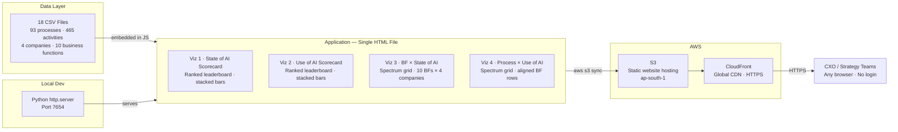
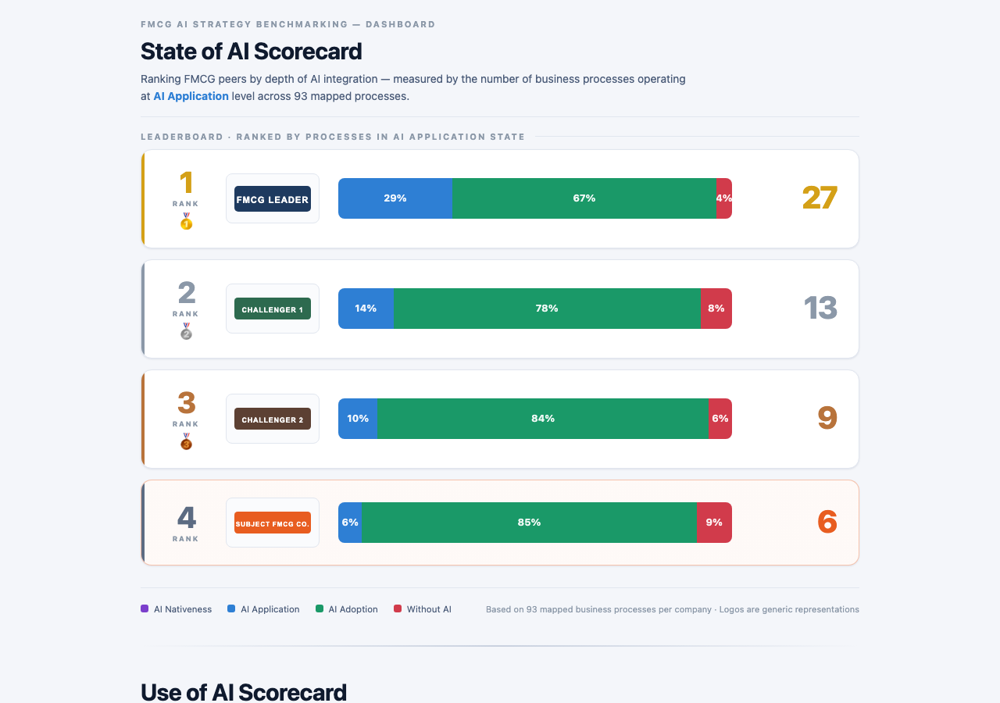
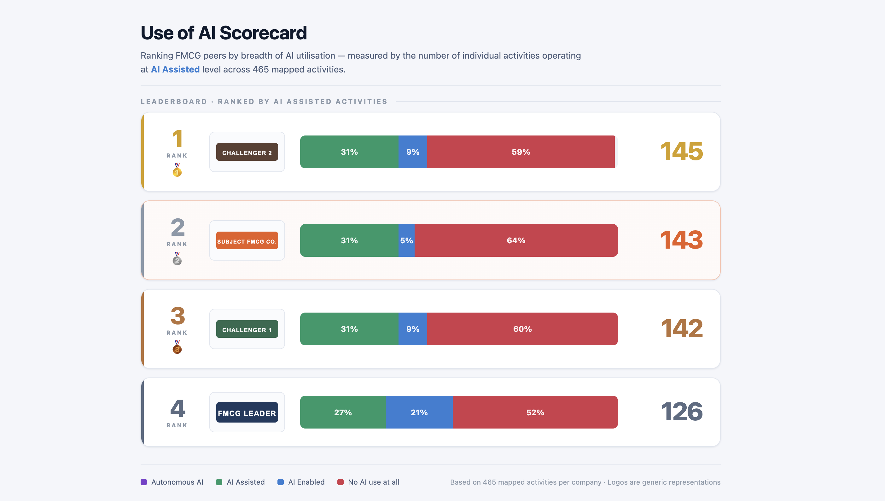
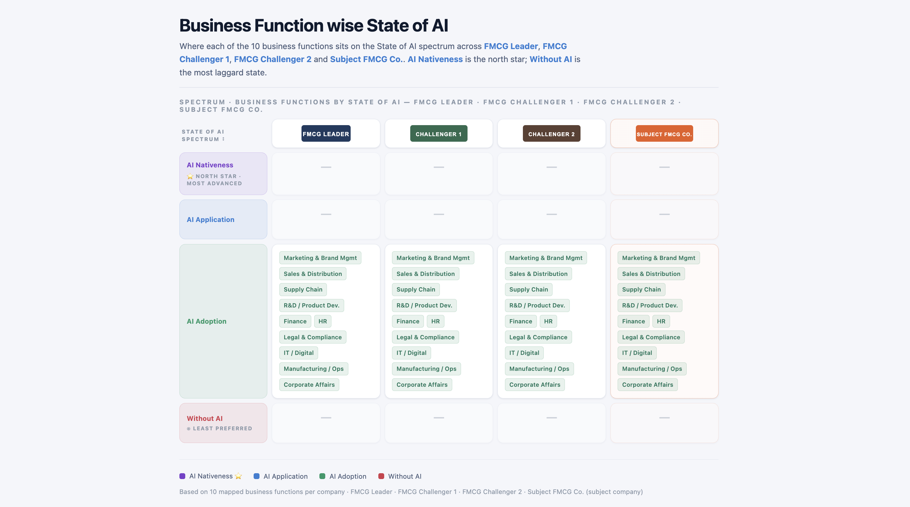
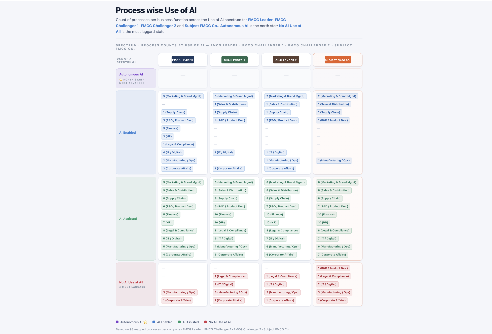

# FMCG AI Benchmarking Dashboard

> Four-panel interactive dashboard benchmarking the State and Use of AI across 93 processes and 10 business functions for a subject FMCG company against three global peers — built for CXO-level strategic decision-making.

[](https://d2hzpx71woh3es.cloudfront.net/state_of_ai_scorecard.html)




---

## Problem

FMCG companies face a critical strategic gap: they have no structured way to assess *where exactly* they stand on AI adoption — at the process or business function level — compared to global peers. Boardroom conversations default to high-level impressions ("we're behind on AI") with no structured view of *where*, *by how much*, and *what matters most*.

Existing benchmarking approaches produce static slide decks that are outdated by the time they're presented. Strategy teams spend weeks pulling data across 400+ activities and 90+ processes before a single slide is created.

## Solution

A single-file interactive dashboard that maps the **State of AI** (AI Application / AI Adoption / AI Nativeness) and **Use of AI** (AI Assisted / AI Enabled / Autonomous AI) across:

- **93 processes** spanning 10 business functions
- **4 companies** (subject company + 3 global FMCG peers)
- **465 activities** at granular resolution

The dashboard answers four strategic questions in one view:

1. **Where do we rank overall?** (Viz 1 — State of AI Scorecard)
2. **How intensively is AI actually used, activity by activity?** (Viz 2 — Use of AI Scorecard)
3. **Which business functions are leading vs. lagging?** (Viz 3 — Business Function Spectrum)
4. **Where exactly are the process-level gaps, by function?** (Viz 4 — Process × Use of AI Spectrum)

## Architecture

All data is pre-processed from 18 CSV source files and embedded directly into the JavaScript — no server-side compute, no API calls, no database. The dashboard is a single `.html` file that can be opened locally or served from any static host.

See [ARCHITECTURE.md](ARCHITECTURE.md) for full component breakdown and design decisions.

## Live Demo

**[https://d2hzpx71woh3es.cloudfront.net/state_of_ai_scorecard.html](https://d2hzpx71woh3es.cloudfront.net/state_of_ai_scorecard.html)**

Hosted on AWS CloudFront (global CDN, HTTPS). No login required. Company names are anonymised in this public version.

### Try it yourself

Scroll through all four panels top to bottom. Start with Viz 1 to see the overall leaderboard, then zoom into Viz 4 for process-level gaps. The orange-highlighted column is the subject company.

> **Note:** The dashboard uses FMCG-flavoured anonymised labels (FMCG Leader, FMCG Challenger 1/2, Subject FMCG Co.) in this public version.

## Tech Stack

| Layer | Technology |
|---|---|
| Frontend | Single HTML file — vanilla JS, no framework, no build tools |
| Hosting (prod) | AWS CloudFront — global CDN, HTTPS, redirect-to-https |
| Storage (prod) | AWS S3 — static website hosting, ap-south-1 |
| Local dev | Python `http.server` — port 7654 |
| Data source | 18 CSV files — 93 processes, 465 activities, 10 business functions |
| Deployment | AWS CLI — `aws s3 sync` + `aws cloudfront create-invalidation` |
| Development | Claude Code (Anthropic) — agentic development assistance |

## Features

- **Four integrated visualisations** — State of AI and Use of AI, at both leaderboard and granular spectrum level
- **CXO-grade design** — 52px stacked bars, consistent colour system, company logos, no chart-junk
- **Line-of-sight alignment** — Viz 4 uses fixed 30px rows so the same business function sits on the same visual row across all four company columns — instant cross-company comparison
- **Colour-coded tiers** — AI Nativeness (purple), AI Application / AI Enabled (blue), AI Adoption / AI Assisted (green), Without AI (red)
- **Subject company highlighting** — orange left border and column highlight throughout
- **Medal rankings** — 🥇🥈🥉 with gold/silver/bronze colour coding
- **Responsive %  labels** — segment labels only shown when the bar segment is wide enough to hold them (≥4%)
- **Zero dependencies** — one `.html` file, no npm, no build step, works offline

## Getting Started

### Prerequisites

- Python 3 (for local dev server)
- AWS CLI configured with appropriate permissions (for deployment only)

### Running locally

```bash
# Clone the repo
git clone https://github.com/upadhyayanurodh/fmcg-ai-benchmarking-dashboard.git
cd fmcg-ai-benchmarking-dashboard

# Serve the Build folder
python3 -m http.server 7654 --directory Build

# Open in browser
open http://localhost:7654/state_of_ai_scorecard.html
```

No installation, no dependencies, no configuration required.

### Deploying to AWS

```bash
# Sync to S3
aws s3 sync Build s3://YOUR-BUCKET-NAME \
  --delete \
  --cache-control "no-cache, no-store, must-revalidate"

# Invalidate CloudFront cache
aws cloudfront create-invalidation \
  --distribution-id YOUR-DISTRIBUTION-ID \
  --paths "/*"
```

See [ARCHITECTURE.md](ARCHITECTURE.md) for the full AWS setup walkthrough.

## Adapting to Your Data

The dashboard has four independent data blocks inside `Build/state_of_ai_scorecard.html`. Edit them to swap in your own companies and numbers — no build step required.

### Step 1 — Set your totals

```js
const TOTAL_PROCESSES = 93;   // line ~595 — all tier counts per company must sum to this
const TOTAL_ACTIVITIES = 465; // line ~681 — all activity counts per company must sum to this
```

If these constants don't match the actual sum of your tier data, bar percentages will silently add to the wrong number.

### Step 2 — Viz 1 data (State of AI Scorecard)

```js
const companies = [
  { name: "Company A", logo: "assets/logos/a.svg", isSubject: false,
    aiNative: 0, aiApp: 27, aiAdop: 62, withoutAI: 4 }, // must sum to TOTAL_PROCESSES
  { name: "Your Company", logo: "assets/logos/subject.svg", isSubject: true,
    aiNative: 0, aiApp: 6, aiAdop: 79, withoutAI: 8 },
];
```

Set `isSubject: true` on the company to highlight in orange. Pre-sort the array descending by `aiApp` — rank is derived from array order.

### Step 3 — Viz 2 data (Use of AI Scorecard)

```js
{ name: "Company A", logo: "...", isSubject: false,
  autoAI: 0, aiAssist: 145, aiEnable: 44, noAI: 276 } // must sum to TOTAL_ACTIVITIES
```

Pre-sort descending by `aiAssist`.

### Step 4 — Viz 3 data (Business Function × State of AI)

```js
{ bfStates: [2, 1, 2, 2, 1, 2, 2, 2, 2, 4] } // one integer per BF
```

State IDs: `1` = AI Application · `2` = AI Adoption · `3` = AI Nativeness · `4` = Without AI. Array index maps to the `BFS` list order.

### Step 5 — Viz 4 data (Process × Use of AI)

```js
bfCounts: [
  [0, 5, 5, 0],  // BF1 → [Autonomous AI, AI Enabled, AI Assisted, No AI]
  [0, 0, 9, 0],  // BF2
  ...
]
```

**Critical constraint:** each BF must have the same total process count across every company column (e.g. if BF1 has 10 processes, it must be 10 for all companies). Unequal counts cause Viz 4's fixed-height rows to misalign across columns — no error is thrown.

### Step 6 — Update the BF list if your taxonomy differs

The `BFS` array (business function names) appears twice — once for Viz 3 and once for Viz 4. Update both if you use different functions or a different number of them.

### Step 7 — Add your logos

Drop SVG files into `Build/assets/logos/` and update the `logo:` path in each data block. See the existing files for format reference (rectangle, solid background, white text, `viewBox="0 0 140 40"`).

> **Note:** The tier classification criteria (what makes a process "AI Application" vs "AI Adoption" etc.) are specific to the benchmarking methodology used in this project and are not included in this repo. You will need to define your own scoring rubric before populating the data arrays.

## Demo

### Viz 1 — State of AI Scorecard
Ranked leaderboard of all four FMCG companies by processes operating at AI Application level across 93 mapped processes.



### Viz 2 — Use of AI Scorecard
Ranked leaderboard by breadth of AI utilisation — activities operating at AI Assisted level across 465 mapped activities.



### Viz 3 — Business Function × State of AI
Spectrum grid showing where each of the 10 business functions sits on the State of AI spectrum, across all four companies.



### Viz 4 — Process × Use of AI
Process-count spectrum grid with fixed-height aligned rows — enabling direct cross-company comparison at business function level.



## Key Decisions & Tradeoffs

**Single HTML file over a multi-file SPA** — All JS, CSS, and data live in one `state_of_ai_scorecard.html`. The upside: zero build tooling, instant deployment, works from a file:// URL. The downside: the file grows large as data is embedded (~39KB). For a data-fixed dashboard with no user input, this is the right call — there is nothing to build.

**Data embedded in JS over a runtime API** — The 18 CSV source files are pre-processed and the aggregated values embedded directly in the JS data arrays. This eliminates all runtime latency and CORS complexity, makes the dashboard work offline, and removes any server dependency. The tradeoff is that data updates require re-embedding — acceptable for a quarterly benchmarking cadence.

**Vanilla JS over React/Vue/D3** — All four visualisations are built with DOM string concatenation and CSS Grid. No virtual DOM, no reactive state, no charting library. This keeps the bundle to a single file, makes the code auditable by any developer without framework knowledge, and renders in under one second on any modern device for this dataset size.

**Fixed 30px BF rows in Viz 4 for line-of-sight** — The process-count spectrum (Viz 4) uses fixed-height rows (`.spec-bf-row { height: 30px }`) with gap-rows where a business function has zero processes in a tier. This ensures the same business function always sits on the same visual row across all four company columns — a deliberate design decision for CXO readability, prioritised over compactness.

**CloudFront over direct S3 URL** — S3 static website endpoints are HTTP-only. CloudFront adds HTTPS, global edge caching, and `redirect-to-https`. The extra setup (distribution creation + 15-min propagation) is worth it for a shared link that will appear in executive decks.

**CSS variables for the colour system** — All tier colours are defined once as CSS variables (`--ai-app`, `--ai-adop`, `--ai-native`, `--no-ai`). Swapping the entire colour scheme for all four visualisations requires changing two hex values. Hardcoded `rgba()` values in tier labels and chips were also updated to match — a one-time cost for long-term consistency.

## Lessons Learned

**Unicode escapes in JS data vs. HTML entities are different search targets** — Company names containing special characters (accented letters, ampersands, typographic apostrophes) appear in two forms: unicode-escaped in JS data (`’`, `é`, `&`) and as literal UTF-8 or HTML entities (`&amp;`) in HTML text. A simple string replace misses one or the other. Python’s `str.replace()` on the decoded file handles both correctly; `sed` struggles with non-ASCII characters and em dashes on macOS.

**CloudFront distributions take ~15 minutes to propagate globally** — Always kick off `create-distribution` as the first deployment step so it's ready by the time documentation is written. The distribution domain is available immediately in the API response even while `Status: InProgress`.

**`overflow: hidden` on the bar track is cheaper than `border-radius` on each segment** — Rather than applying `border-radius` to every bar segment (which creates sharp internal edges at segment joins), a single `border-radius: 8px` on the `.bar-track` container with `overflow: hidden` clips all child segments cleanly. No JS needed.

**Spectrum grid alignment requires globally-computed row indices** — Viz 4 computes which business functions appear in each tier across all companies before rendering any column. Each column then iterates the global BF list in order, emitting either a chip row or a gap row. This ensures cross-column alignment without absolute positioning or JavaScript post-render measurement.

## Status

Active — v1.0.0 deployed June 2026. Live at [https://d2hzpx71woh3es.cloudfront.net/state_of_ai_scorecard.html](https://d2hzpx71woh3es.cloudfront.net/state_of_ai_scorecard.html).

## Development Tools

Built using [Claude Code](https://claude.ai/code) (Anthropic) for agentic development assistance.

## Author

Anurodh Upadhyay — [LinkedIn](https://linkedin.com/in/anurodhupadhyay) · upadhyayanurodh@gmail.com
